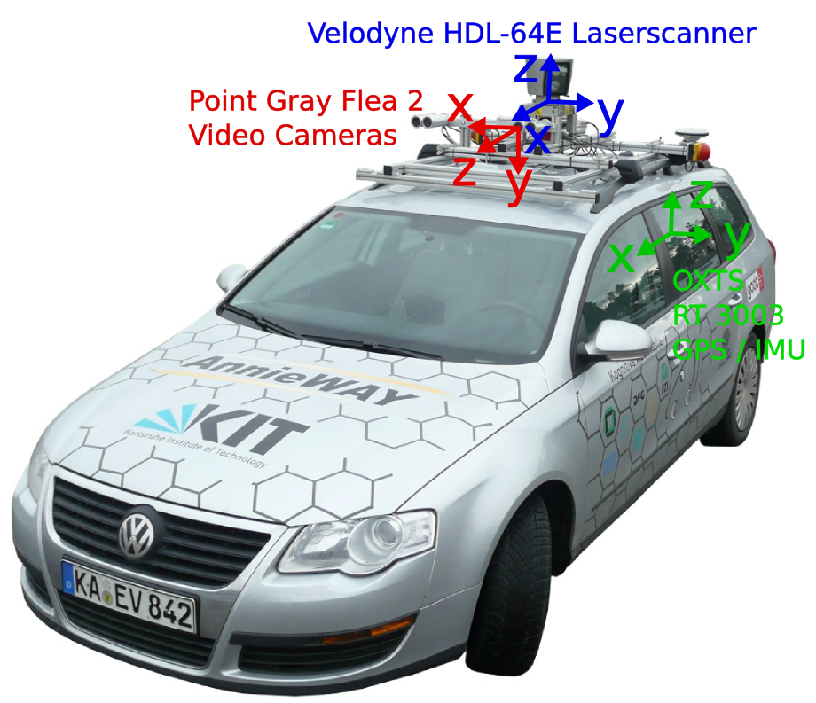

# Displaying the Point Cloud

## Finding Third-Party Plugins for Bevy

With its plugin architecture, Bevy is easily extendable by anyone. And with everything based on the ECS, any Bevy user can become a plugin author or an engine developer. This flexibility allows for a wide range of customization and integration options.

The Bevy community is very active to publish new plugins. You can find them:

- On the website, the [Asset page](https://bevy.org/assets/)
- On Discord, the [#crates channel](https://discord.com/channels/691052431525675048/918591326096850974)

## Third-Party Plugin for Point Clouds

Bevy doesn't support rendering point clouds out of the box, but a user recently created a plugin [`bevy_pointcloud`](https://github.com/rlamarche/bevy_pointcloud), with a [Wasm demo](https://rlamarche.github.io/bevy_pointcloud/).

## Point Clouds

Some sample point clouds are available at <https://www.limon.eu/support/sample-data>.

In this workshop, we will use the KITTI dataset, made for training object detection models. It's available at <https://www.cvlibs.net/datasets/kitti/raw_data.php>.

If your phone has a LiDAR, you can capture a point cloud with it.

Other techniques to build a point cloud are:

- Time of flight
- Stereo vision
- Structure from motion
- Machine learning based monocular depth estimation
- Structured light
- Photogrammetry

But they are harder to setup, less accurate, or require more processing power.

## First Step

Let's display a small point cloud, to check how it looks.

To use `bevy_pointcloud`, we need to:

- Add the `PointCloudPlugin` plugin
- Add the `LasLoaderPlugin` plugin
- Configure the `Camera3d` to not use Indirect Drawing, and no MSAA, with the `NoIndirectDrawing` and `Msaa` components
- Configure the `Camera3d` to render point clouds, with the `PointCloudRenderMode` component
- Spawn the point cloud, with the `PointCloud3d` and `PointCloudMaterial3d` components

```rust,no_run
# extern crate bevy;
# extern crate bevy_pointcloud;
# use bevy::{prelude::*, render::view::NoIndirectDrawing};
# use bevy_pointcloud::{
#     PointCloudPlugin,
#     loader::las::LasLoaderPlugin,
#     point_cloud::PointCloud3d,
#     point_cloud_material::{PointCloudMaterial, PointCloudMaterial3d},
#     render::PointCloudRenderMode,
# };
fn main() {
    App::new()
        .add_plugins((
            DefaultPlugins,
            PointCloudPlugin,
            LasLoaderPlugin,
        ))
        .add_systems(Startup, setup)
        .run();
}

fn setup(
    mut commands: Commands,
    asset_server: Res<AssetServer>,
    mut point_cloud_materials: ResMut<Assets<PointCloudMaterial>>,
) {
    commands.spawn((
        Camera3d::default(),
        Transform::default(),
        Camera::default(),
        NoIndirectDrawing,
        Msaa::Off,
        PointCloudRenderMode::default(),
    ));

    commands.spawn((
        PointCloud3d(asset_server.load("sample-pointclouds/lion_takanawa.copc.laz")),
        PointCloudMaterial3d(point_cloud_materials.add(PointCloudMaterial { point_size: 50.0 })),
    ));
}
```

The default camera is not very useful. We can either use a fly camera controller (like [the one provided in Bevy examples](https://github.com/bevyengine/bevy/blob/release-0.17.2/examples/helpers/camera_controller.rs)) or a [Pan/Orbit camera controller](https://crates.io/crates/bevy_panorbit_camera).

## About KITTI

KITTI was recorded in Germany in 2011 with a car with cameras and a LiDAR:



Recording are made of several frames, each with a point cloud and photos.

One recording is made available in an easy to use format in the repo, more are available at <https://drive.google.com/file/d/1BDvaCX2748OcW7aPPngLRmZqTk4ms_ee/view?usp=share_link>.

It doesn't have color but instead intensity, the return strength of the laser. I've converted this information to color, blue for low intensity, green for high.

It is common when rendering point clouds to be able to switch between different rendering modes:

- Point color
- Beam intensity
- Point height

`bevy_pointcloud` only supports color for now.
